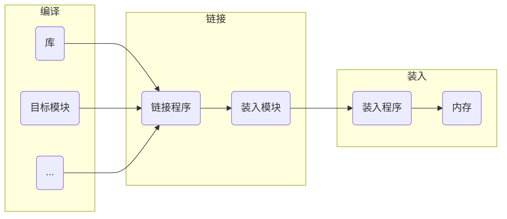

# 3.1.1 内存管理的基本原理和要求

**帕金森定律：**不管存储器有多大，程序都可以把它填满。

**分层存储器体系 (memory manger)：**这个体系中计算机有若干兆(MB)快速、昂贵且易失性的高速缓存(cache)，数千兆(GB)速度与价格适中且同样易失性的内存，以及几兆兆(TB)低俗、廉价、非易失性的磁盘存储，另外还有DVD、USB等可移动存储装置。操作系统的工作是将这个存储体系抽象为一个有用的模型并管理这个抽象模型。

**存储管理器：**操作系统中管理分层存储器体系的部分。它的任务是有效地管理内存，即记录哪些内存是正在使用的，哪些内存是空闲的；在进程需要时为其分配内存，在进程使用完后释放内存。

**为什么需要内存：**用于读写的存储单元的价格会随着其读写速度的增大而变得十分昂贵，能够满足CPU读写速度的存储单元价格更是难以接受的，以三星为例，内存的价格在16元/G左右，而固态硬盘的价格在0.3元/G。内存的带宽可达32GB/s，而固态的读写速度仅有4500MB/S。为了满足CPU的带宽需求(i5 10300H的带宽为45.8GB/s)，我们需要少量(相比外存而言)的存储空间以发挥CPU的全部性能。

**内存管理的主要功能：**

+ 内存空间的分配与回收：由操作系统完成主存储器空间的分配和管理，使程序员摆脱存储分配的麻烦，提高编程效率。
+ 地址转换：在多道程序环境下，程序中的逻辑地址与内存中的物理地址不可能一致，因此存储管理必须提供地址变换功能，把逻辑地址转换成相应的物理地址。
+ 内存空间的扩充：利用虚拟存储技术或自动覆盖技术，从逻辑上扩充内存。
+ 内存共享：指允许多个进程访问内存的同一部分。
+ 存储保护：保证各道作业在各自的存储空间内运行，互不干扰。

#### 1. 程序的链接与装入

创建进程首先要将程序和数据装入内存。将用户源程序变为可在内存中执行的程序，其步骤如下：

+ 编译：由编译程序将用户源代码编译成若干目标模块。
+ 链接：由连接程序将编译后形成的一组目标模块及它们所需的库函数链接在一起，形成一个完整的装入模块。
+ 装入：由装入程序将装入模块装入内存运行。

##### (1) 程序的链接方式：

**① 静态链接：**

​	**概念：**在程序运行前，先将各目标模块及它们所需的库函数链接成一个完整的装配模块，以后不再拆开。

​	**需要在链接时解决的问题：**

+ 修改相对地址，编译后的所有目标模块都是从0开始的相对地址，当链接成一个装入模块时要修改相对地址。
+ 变换外部调用符号，将每个模块中所用的外部调用符号也都变换为相对地址。

**② 装入时动态链接：**

​	**概念：**将用户源程序编译后所得到的一组目标模块，在装入内存时，采用边装入边链接的方式。

​	**优点：**便于修改和更新，便于实现对目标模块的共享。

**③ 运行时动态链接：**

​	**概念：**凡在执行过程中未被用的目标模块，都不会被调入内存和被连接到装入模块上。

​	**优点：**能加快程序的装入过程，还可节省大量的内存空间。

##### (2) 内存装入模块装入内存的方式

**① 绝对装入：**

若已知某程序将要被放置在内存中的具体位置，编译程序将在编译时生成绝对(物理)地址的目标代码。之后，绝对装入程序将按照装入模块中的地址，将程序和数据装入内存。此时，程序的逻辑地址和物理地址相同，无需进一步修改。

另外，程序中所用的绝对地址，不仅可在编译或汇编时生成，也可由程序员直接赋予。通常情况下，在程序中采用的是符号地址，编译或汇编时再转换成绝对地址。

**适用环境：**只适用于单道程序环境。

**特点：**

+ 程序在内存中的位置是预先知道的。
+ 装入的地址是绝对地址。

**备注：**物理地址\=绝对地址 	逻辑地址\=相对地址

**② 可重定位装入：**

在多道程序环境下，多个目标模块的起始地址通常都从0开始，程序中的其他地址都是相对于起始地址的，此时应采用可重定位装入方式。根据内存的当前情况，将装入模块装入内存的适当位置。

**适用环境：**用于多道程序环境且程序在内存中的位置不会在执行时改变。

**重定位：**在装入时对目标程序中指令和数据地址的修改过程。

在绝对装入中，由于地址变换常在进程装入时一次性完成，故该过程可称为静态重定位。

**特点：**

+ 装入模块中使用逻辑地址，在真正被装入时才将逻辑地址转换为物理地址。
+ 地址变换是装入时一次性完成的，因此程序运行期间不可移动。
+ 装入时就必须给作业分配其所需要的所有内存空间，若没有足够的内存，则无法装入。程序运行期间也不可申请内存空间。

**③ 动态运行时装入：**

装入程序把装入模块装入内存后，并不立即把装入模块中的相对地址转换为绝对地址，而是把这种地址转换推迟到程序真正要执行时才进行。这种方式需要一个重定位寄存器的支持。

**适用环境：**多道程序环境且程序在内存中的位置会在运行时改变。

**特点：**

+ 可以将程序分配到不连续的存储区。
+ 在程序运行前可以只装入部分代码即可投入运行，然后在程序运行期间根据需求动态分配内存。
+ 便于程序段的共享。
+ 装入程序将装入模块装入内存后，并不立即把装入模块中的相对地址转换为绝对地址，而是等到程序真正要执行时才进行。

##### (3) 实例

**① 使用绝对装入运行单个程序**

有但不仅限于以下三种实现方案

+ 方案A以前被用于大型机和一些小型计算机上，现在很少使用了。
+ 方案B被用于一些掌上电脑和嵌入式系统中。
+ 方案C被用于早期的个人计算机中。

在ROM中的系统部分称为**BIOS ( Basic Input Output System，基本输入输出系统 )** 。方案A和C的缺点是用户程序出现的错误可能摧毁操作系统，引发灾难性后果。

当按这种方式组织操作系统时，通常同一时刻只能有一个进程在运行。一旦用户键入了一个命令，操作系统就把需要的程序从磁盘复制到内存中并执行；当进程运行结束后，操作系统在用户终端显示提示符并等待新的命令。收到新的命令后，它把新的程序装入内存，覆盖前一个程序。

**② 使用可重定位装入方式运行多个不相关程序 ( 以IBM360早期模型为例 )**

**方法：**内存被划分为2KB的块，每个块被分配一个4位的保护键，保护键存储在CPU的特殊寄存器中。一个内存为1MB的机器只需要512个这样的4位寄存器，容量总共为256字节。PSW ( Program Status Word，程序状态字 ) 中存有一个4位码。一个运行中的进程如果访问保护键与其PSW码不同的内存，360的硬件会捕捉到这一事件。因为只有操作系统可以修改保护键，这样就可以防止用户进程之间、用户进程与操作系统之间的互相干扰。当系统决定开始运行第二个程序时，在该程序装载到内存的时候会通过静态重定位技术修改该程序的每一个程序地址。

**③ 使用动态运行装入运行多个不相关程序 ( 以CDC6600、Intel8088为例)**

**方法：**给每个CPU配置两个特殊硬件寄存器，通常叫做基址寄存器和界限寄存器。

#### 2.逻辑地址与物理地址

**逻辑地址：**编译后，每个目标模块都从0号单元开始编址，这称为该目标模块的相对地址。也称为相对地址。

**逻辑地址空间：**当链接程序将各个模块链接成一个完整的可执行目标程序时，链接程序顺序依次按各个模块的相对地址构成统一的从0号单元开始编址的逻辑地址空间。也称虚拟地址空间。

**物理地址：**内存中的真实地址。

**物理地址空间：**内存中物理单元的集合，它是地址转换的最终地址。

**地址重定位：**当装入程序将可执行代码装入内存时，必须通过地址转换将逻辑地址转换为物理地址，这一过程称为地址重定位。

操作系统通过内存部件 ( MMU )将进程的逻辑地址转换为物理地址。进程使用虚拟内存空间中的地址，操作系统在相关硬件的协助下，将它转换成真正的物理地址。逻辑地址通过页表映射到物理内存，页表由操作系统维护并被处理器引用。

#### 3. 进程的内存映像

**进程的内存映像：**当一个可执行文件调入内存运行时，就构成了进程的内存映像。

**要素：**

+ 代码段：程序的二进制代码，代码段是只读的，可以被多个进程共享。
+ 数据段：程序运行时加工处理的对象，包括全局变量和静态变量。
+ 进程控制块 ( PCB )：存放在系统区。操作系统通过PCB来控制和管理进程。 
+ 堆：用来存放动态分配的变量。通过调用`malloc`函数动态地向高地址分配空间。
+ 栈：用来实现函数调用。从用户空间最大地址往低地址方向增长。

如上图，是一个进程在内存中的映像。

+ 共享库：用于存放进程用到的共享函数库代码。
+ 只读代码：
  + `.init`：程序初始化时调用的`_init`函数。
  + `.text`：用户程序的机器代码。
  + `.rodata`：只读数据。
  + `.data`：已初始化的全局变量和静态变量。
  + `.bss`：未初始化及所有初始化为0的全局变量和静态变量。

| 要素          | 大小扩展契机          | 大小收缩契机          |
| ------------- | --------------------- | --------------------- |
| 代码段/数据段 | 已被指定 无法动态更改 | 已被指定 无法动态更改 |
| 栈            | 某个函数被调用        | 从一个函数返回        |
| 堆(以C为例)   | 调用malloc函数        | 调用free函数          |

#### 4. 内存保护

**方法：**

(1) 在CPU中设置一对上下限寄存器，存放用户作业在主存中的下限和上限地址，每当CPU要访问一个地址时，分别和两个寄存器的值相比，判断有无越界。

(2) 采用重定位寄存器 ( 又称基地址寄存器 ) 和界地址寄存器 ( 又称限长寄存器 )来实现这种保护。

​	 其中，重定位寄存器含有物理地址的最小值。界地址寄存器含有逻辑地址的最大值。

​	 注意：重定位寄存器是用来与逻辑地址相加得到物理地址的，界地址寄存器是用来比较逻辑地址是否越界的。

**使用重定位寄存器与界地址寄存器重定位的缺点：**

每次访问内存都需要进行加法和比较运算。比较运算可以做的很快，但是加法运算由于进位传递时间的问题，在没有使用特殊电路的情况下会显得很慢。

#  3.1.2 覆盖与交换技术

**应用场景：**覆盖与交换技术是在多少程序环境下用来扩充内存的两种方式。

#### 1. 覆盖

**基本思想：**把用户空间分成一个固定区和若干覆盖区。将经常活跃的部分放在固定区，其余部分按调用关系分段。首先将那些即将要访问的段放入覆盖区，其他段放在外存中，在需要调用前，系统在将其调入覆盖区，替换覆盖区中原有的段。

**备注：**我们将虚拟内存分为核心空间和用户空间，内核、核心扩充和驱动程序运行在内核空间，而其他的应用程序运行在用户空间。核心空间的特权级别比用户空间要高。

假设有一程序调用结构如下图，其中模块A的调用频率最高，调用其他任何一个模块时，模块A都会被调用。模块B与C不会同时被访问，模块D、E、F不会同时被访问。

若不使用覆盖模块，则要想将该程序全部放入内存，需要的内存总量为$(8+10+12) + (8+10+8) + (8+8+4)$k。

使用覆盖技术时，按照程序内模块的调用结构，我们将模块A放入固定区，模块B、C放在同一个覆盖区，模块D、E、F放在同一个覆盖区，如下图，则将该程序全部放入内存所需的内存总量为$8 + max(10, 8) + max(12, 8, 4) = 8 + 10 + 12$k。

**特点：**

+ 打破了必须将一个进程的全部信息装入主存后才能运行的限制，但当同时运行程序的代码大于主存时仍不能运行
+ 内存中能够更新的地方只有覆盖区的段，不在覆盖区中的段会常驻内存
+ 覆盖技术对用户和程序员不透明

#### 2. 交换

**基本思想：**把处于等待状态的程序从内存移到辅存，把内存空间腾出来，这一过程又称为换出；把准备好竞争CPU运行的程序从辅存移到内存，这一过程又称换入。

**需要注意的问题：**

+ 交换需要备份存储，通常是硬盘。它必须足够大，并提供对这些内存映像的直接访问。
+ 为了有效使用CPU，需要使每个进程的执行时间比交换时间长。
+ 若换出进程，则必须确保该进程完全处于空闲状态。
+ 交换空间通常作为磁盘的一整块，且独立于文件系统，因此使用起来可能很快。
+ 交换通常在有许多进程运行且内存空间吃紧时开始启动，而在系统负荷降低时就暂停。
+ 普通的交换使用不多，但交换策略的某些变体在许多系统(如UNIX)中仍发挥作用。

# 3.1.3 连续分配管理方式

**概念：**指系统为用户分配一个连续的内存空间（操作系统从用户空间中切割出一段连续的空间作为一个新的分区，供用户使用）

**内部碎片与外部碎片的区别：**

+ 内部碎片是分区分配方式中，划分出来的某个分区内无法被利用的内存块。
+ 外部碎片是分区分配方式中，用户空间中无法被利用的内存块。

#### 1. 单一连续分配

**思想：**内存被分为系统区和用户区。系统区通常在低地址部分，仅供操作系统使用；用户区中，每次装入仅装入一道用户程序，整个内存的用户空间由该程序独占。

**优点：**简单、无外部碎片，无需进行内存保护。

**缺点：**只能用于单用户、单任务的操作系统中，有内部碎片，存储器的利用率极低。

#### 2. 固定分区分配

**思想：**将用户内存空间划分为若干大小固定的区域，每个分区只装入一道作业。当有空闲分区时，便可再从外存的后备作业队列中选择适当大小的作业装入该分区。

**两种划分分区的方法：**

+ 分区大小相等：程序太小会造成浪费，程序太大又无法装入，缺乏灵活性。
+ 分区大小不等：划分为多个较小的分区、适量的中等分区和少量大分区。

**管理分区的方式：**建立分区使用表，通常按分区大小排列。表中每一项包括每个分区的起始地址、大小以及分配状态。如下表，每次分配内存，只需检索该表，若可以找到一个未分配的符合要求的分区，则将相应表项状态修改为"已分配"；若否，则拒绝分配内存。 

| 分区号 | 大小/KB | 起始地址/KB | 状态   |
| ------ | ------- | ----------- | ------ |
| 1      | 12      | 20          | 已分配 |
| 2      | 32      | 32          | 已分配 |
| 3      | 64      | 64          | 已分配 |
| 4      | 128     | 128         | 未分配 |

 

#### 3. 动态分区分配

**思想：**在程序装入内存时，根据进程的实际需要，动态地分配内存，使得分区的大小刚好可以满足进程的需要。因此，系统中分区的大小和数目都是可变的。

**外部碎片：**随着用户空间被不断地分割、回收，较长一段时间后，内存中会产生大量小内存块无法被利用，即产生大量外部碎片。

**紧缩技术：**为了解决上面的外部碎片问题，提高内存的利用率，可以通过紧缩技术，由操作系统不时地对进程进行移动和整理。该技术需要动态重定位寄存器的支持，且相对费时。

假设有如下用户空间目标分配状态，其中分区A占8个单位，分区B占5个内存单位，分区C占12个单位：

+ 分配内存：操作系统按照堆栈的方式，依次将分区A、B、C压入用户空间堆栈，并维护一个始终指向高地址（栈顶）的栈指针。
+ 回收内存：存在两种触发时机，一是每次用户（广义，包括进程等，下同）释放内存时，二是用户空间不足或栈顶指针指向用户空间最高地址时。
  1. 计算分区的新地址。设立两个指针随巡查移动，分别用于指向内存紧缩后分区的原地址和新地址。因此，分区的第一个内存单位需要在分区大小和标志域外，新增一用于存储紧缩后应有的新地址的地址域（即建立一新旧地址对照表）
  2. 修改用户初始变量。保证内存紧缩后，用户可以找到自己的地址。
  3. 检查各分区存储的数据，若有指向其他分区的指针，修改之。
  4. 将分区迁移到紧缩后的新地址。
  5. 更新栈顶指针的值。

可见，紧缩技术相当复杂，因此非迫不得已不会使用。

##### 动态分区分配策略

| 算法                  | 思想                                                         | 优点                                         | 缺点                                                         |                             算法                             |
| :-------------------- | :----------------------------------------------------------- | :------------------------------------------- | ------------------------------------------------------------ | :----------------------------------------------------------: |
| 首次适应/首次适配算法 | 空闲分区以地址递增的次序链接。分配内存时，从链首开始顺序查找，找到大小能够满足要求的第一个空闲分区分配给作业。 | 最简单、通常是最快、最好的。                 | 会使低地址部分出现很多很小的空闲分区，而每次查找都需要经过这些分区，增大了开销。 | 建立一个双向链表，初始时，该链表头指针和尾指针重合。开始分配时，按照所需分区大小建立新的节点，查找策略见"思想"。内存回收时，需要查询该节点能否与前后节点合并。 |
| 临近适应/下次适配算法 | 与首次适应算法相似，但每次查找的起始地址并非从最低地址开始，而是从上次查找到地方开始搜索。 | 节省了首次适应算法从头开始查找所需的开销     | 通常会导致用户空间尾部分裂成小碎片，性能通常比首次适应算法略差。 | 类似首次适应算法，但使用一个双向循环链表来记录而非双向链表。此外，还需要一个特别的指针来标记当前查找到的位置。 |
| 最佳适应/最佳适配算法 | 需要将空闲分区按大小递增排序，找到第一个能够满足需求的分区分配给作业。 | 可以尽可能保留大分区                         | 由于每次优先使用较小的分区，随着内存的使用，会产生越来越多、很小的、难以处理的外部碎片。此外，由于需要维护一个有序的空闲分区大小排列，算法性能很差。 | 可用小根堆对空闲分区进行排序。由于并非严格按照地址高低顺序进行分配，两个空闲区块很可能不相邻，因此无法及时合并空闲区块，从而产生大量外部碎片。 |
| 最坏适应/最差适配算法 | 类似最佳适应算法，但是对空闲分区进行排序时是按照从大到小的顺序排序。 | 可以减少难以利用的、很小的空闲分区碎片的数量 | 会很快导致没有可以使用的大空闲分区。算法性能很差（原因同上） |          类似最佳适应算法，但可使用大根堆进行排序。          |
